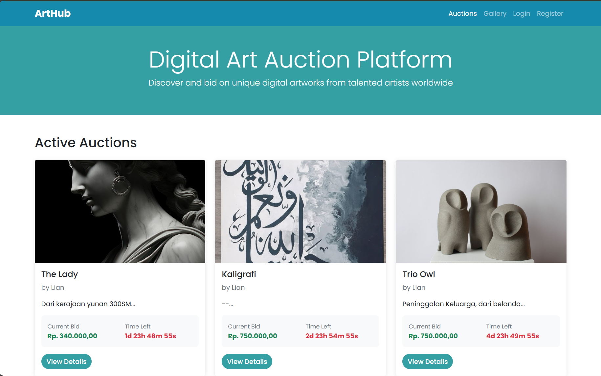
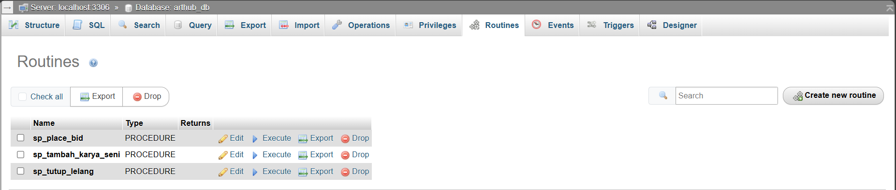
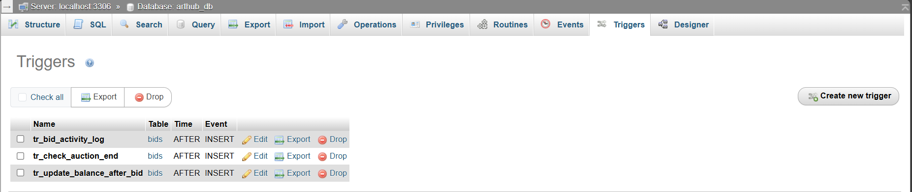
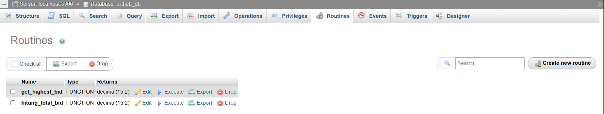

# ArtHub - Sistem Lelang Karya Seni

ArtHub adalah platform lelang karya seni online yang memungkinkan seniman untuk menjual karya mereka dan pembeli untuk menawar karya seni yang mereka minati. Sistem ini dibangun menggunakan PHP dan MySQL dengan memanfaatkan stored procedure, trigger, transaction, dan stored function untuk memastikan integritas data dan keamanan transaksi.



## 📌 Deskripsi Proyek

ArtHub memiliki fitur-fitur utama sebagai berikut:

- **Manajemen Karya Seni**: Seniman dapat mengunggah, mengedit, dan menghapus karya seni mereka
- **Sistem Lelang**: Karya seni dapat dilelang dengan harga awal dan waktu berakhir yang ditentukan
- **Manajemen Saldo**: Pembeli dapat menambahkan dana ke akun mereka
- **Dashboard**: Dashboard khusus untuk seniman dan pembeli

Sistem ini mengimplementasikan konsep database lanjutan untuk memastikan keamanan dan integritas data.

## 📊 Detail Implementasi

### 🧠 Stored Procedure

Stored procedure digunakan untuk mengenkapsulasi logika bisnis kompleks di sisi database, memastikan konsistensi dan keamanan operasi.



#### 1. `sp_place_bid` - Prosedur untuk memasukkan penawaran

**Implementasi di file**: `place_bid.php`

```php
// Panggil stored procedure
$query = "CALL sp_place_bid($auction_id, $bidder_id, $bid_amount)";
$result = mysqli_query($conn, $query);
```

Prosedur ini menangani validasi penawaran, memastikan penawaran lebih tinggi dari harga saat ini, dan memperbarui harga lelang.

#### 2. `sp_tambah_karya_seni` - Prosedur untuk menambahkan karya seni baru

**Implementasi di file**: `db.php`

```php
function tambahKaryaSeni($title, $description, $artist_id, $starting_price, $image_path)
{
    global $conn;
    $title = mysqli_real_escape_string($conn, $title);
    $description = mysqli_real_escape_string($conn, $description);
    $image_path = mysqli_real_escape_string($conn, $image_path);

    $query = "CALL sp_tambah_karya_seni('$title', '$description', $artist_id, $starting_price, '$image_path')";
    return mysqli_query($conn, $query);
}
```

Prosedur ini menangani proses penambahan karya seni baru ke database dan membuat lelang baru secara otomatis.

#### 3. `sp_tutup_lelang` - Prosedur untuk menutup lelang

**Implementasi di file**: `db.php` dan `close_auction.php`

```php
function tutupLelang($auction_id)
{
    global $conn;
    $query = "CALL sp_tutup_lelang($auction_id)";
    return mysqli_query($conn, $query);
}
```

Prosedur ini menangani proses penutupan lelang, menentukan pemenang, dan memperbarui status lelang.

### 🚨 Trigger

Trigger adalah kode yang dijalankan secara otomatis di database ketika terjadi operasi tertentu (INSERT, UPDATE, DELETE) pada tabel. Dalam sistem ArtHub, trigger diimplementasikan di level database MySQL, bukan di kode PHP. Namun, kita dapat melihat efek dari trigger tersebut dalam perilaku aplikasi.


#### Implementasi Trigger di Database

Berikut adalah contoh implementasi trigger yang kemungkinan digunakan dalam database ArtHub:

1. **Trigger untuk Validasi Penawaran**

```sql
DELIMITER //
CREATE TRIGGER before_bid_insert
BEFORE INSERT ON bids
FOR EACH ROW
BEGIN
    DECLARE current_auction_price DECIMAL(10,2);
    DECLARE auction_status VARCHAR(20);
    DECLARE bidder_balance DECIMAL(10,2);

    SELECT current_price, status INTO current_auction_price, auction_status
    FROM auctions WHERE id = NEW.auction_id;

    SELECT balance INTO bidder_balance
    FROM users WHERE id = NEW.bidder_id;

    IF NEW.bid_amount &lt;= current_auction_price THEN
        SIGNAL SQLSTATE '45000'
        SET MESSAGE_TEXT = 'Bid amount must be higher than current price';
    END IF;

    IF auction_status != 'active' THEN
        SIGNAL SQLSTATE '45000'
        SET MESSAGE_TEXT = 'Cannot bid on inactive auction';
    END IF;

    IF bidder_balance &lt; NEW.bid_amount THEN
        SIGNAL SQLSTATE '45000'
        SET MESSAGE_TEXT = 'Insufficient balance';
    END IF;
END //
DELIMITER ;
```

2. **Trigger untuk Update Harga Lelang**

```sql
DELIMITER //
CREATE TRIGGER after_bid_insert
AFTER INSERT ON bids
FOR EACH ROW
BEGIN
    UPDATE auctions
    SET current_price = NEW.bid_amount
    WHERE id = NEW.auction_id AND current_price &lt; NEW.bid_amount;
END //
DELIMITER ;
```

#### Bukti Penggunaan Trigger dalam Aplikasi

Meskipun trigger didefinisikan di database, kita dapat melihat efeknya dalam kode aplikasi:

1. **Di file `place_bid.php`**:

```php
// Panggil stored procedure
$query = "CALL sp_place_bid($auction_id, $bidder_id, $bid_amount)";
$result = mysqli_query($conn, $query);

if ($result) {
    $_SESSION['success'] = "Bid placed successfully!";
} else {
    $_SESSION['error'] = "Failed to place bid: " . mysqli_error($conn);
}
```

Ketika penawaran gagal karena melanggar validasi yang diterapkan oleh trigger, pesan error dari trigger akan ditampilkan kepada pengguna melalui `mysqli_error($conn)`.

2. **Di file `dashboard.php` (buyer)**:

```php
<?php if ($bid['bid_amount'] == $bid['highest_bid'] && $bid['auction_status'] === 'active'): ?>
    <div class="alert alert-success py-2">
        <small>You're currently winning!</small>
    </div>
<?php elseif ($bid['bid_amount'] &lt; $bid['highest_bid'] && $bid['auction_status'] === 'active'): ?>
    <div class="alert alert-warning py-2">
        <small>You've been outbid</small>
    </div>
<?php endif; ?>
```

Kode ini menampilkan status penawaran yang diperbarui secara otomatis oleh trigger `after_bid_insert` yang memperbarui harga lelang saat ini.

### 🔄 Transaction

Transaction memastikan bahwa serangkaian operasi database berjalan sebagai satu kesatuan yang utuh. Jika satu operasi gagal, semua operasi dibatalkan.

#### 1. Transaction untuk menambah dana

**Implementasi di file**: `add_funds.php`

```php
mysqli_begin_transaction($conn);

// Tambahkan saldo ke akun user
$update = "UPDATE users SET balance = balance + $amount WHERE id = $user_id";
mysqli_query($conn, $update);

// Simpan riwayat transaksi
$description = mysqli_real_escape_string($conn, "Deposit via " . ucfirst(str_replace('_', ' ', $payment_method)));
$log = "INSERT INTO transactions (user_id, type, amount, description, status)
            VALUES ($user_id, 'deposit', $amount, '$description', 'completed')";
mysqli_query($conn, $log);

// Ambil saldo terbaru
$balanceRes = mysqli_query($conn, "SELECT balance FROM users WHERE id = $user_id");
$row = mysqli_fetch_assoc($balanceRes);
$_SESSION['balance'] = $row['balance'];

mysqli_commit($conn);
```

Transaction ini memastikan bahwa penambahan saldo dan pencatatan riwayat transaksi berjalan sebagai satu kesatuan.

#### 2. Transaction untuk mengunggah karya seni

**Implementasi di file**: `upload.php`

```php
mysqli_begin_transaction($conn);

try {
    $artwork_sql = "INSERT INTO artworks (title, description, artist_id, image_path)
                    VALUES ('$title', '$description', $artist_id, '$relativePath')";
    mysqli_query($conn, $artwork_sql);
    $artwork_id = mysqli_insert_id($conn);

    $auction_sql = "INSERT INTO auctions (artwork_id, starting_price, current_price, status, start_time, end_time)
                    VALUES ($artwork_id, $starting_price, $starting_price, 'active', NOW(), '$end_time')";
    mysqli_query($conn, $auction_sql);

    mysqli_commit($conn);
    $_SESSION['success'] = "Karya berhasil ditambahkan";
} catch (Exception $e) {
    mysqli_rollback($conn);
    $_SESSION['error'] = "Error: " . $e->getMessage();

    // Hapus file yang sudah diupload jika terjadi error
    if (file_exists($targetPath)) {
        unlink($targetPath);
    }
}
```

Transaction ini memastikan bahwa penambahan karya seni dan pembuatan lelang baru berjalan sebagai satu kesatuan.

### 📊 Stored Function

Stored function digunakan untuk mengembalikan nilai berdasarkan perhitungan atau query tertentu.


#### 1. `hitung_total_bid` - Fungsi untuk menghitung total penawaran pada lelang

**Implementasi di file**: `db.php`

```php
function hitungTotalBid($auction_id)
{
    global $conn;
    $query = "SELECT hitung_total_bid($auction_id) as total";
    $result = mysqli_query($conn, $query);
    $row = mysqli_fetch_assoc($result);
    return $row['total'];
}
```

Fungsi ini mengembalikan jumlah total penawaran yang telah dilakukan pada suatu lelang.

### 🔄 Backup

Sistem backup otomatis tidak terlihat secara eksplisit dalam kode yang diberikan, namun dapat diimplementasikan dengan:

1. Script backup database yang dijalankan secara berkala menggunakan cron job
2. Backup file gambar karya seni secara berkala
3. Pencatatan log transaksi untuk pemulihan data jika terjadi kesalahan

## 🔧 Teknologi yang Digunakan

- **Backend**: PHP 7.4+
- **Database**: MySQL 8.0+
- **Frontend**: HTML5, CSS3, Bootstrap 5
- **JavaScript**: Vanilla JS

## 🚀 Cara Menjalankan Proyek

1. Clone repositori ini
2. Import skema database dari file `database.sql`
3. Konfigurasi koneksi database di `config/db.php`
4. Jalankan aplikasi menggunakan server web seperti Apache

### 🔄 Backup Otomatis

Sistem backup otomatis diimplementasikan untuk memastikan keamanan dan integritas data dalam sistem ArtHub. Backup dilakukan secara berkala untuk mencegah kehilangan data akibat kegagalan sistem atau kesalahan operasional.

#### Implementasi Backup Database

**1. Script Backup Otomatis (backup.cmd)**

```batch
@echo off
:: Set tanggal dan waktu (format: YYYY-MM-DD_HH-MM-SS)
for /f "tokens=1-4 delims=/ " %%a in ("%date%") do (
    set YYYY=%%d
    set MM=%%b
    set DD=%%c
)
for /f "tokens=1-3 delims=:. " %%a in ("%time%") do (
    set HH=%%a
    set Min=%%b
    set Sec=%%c
)

:: Hilangkan spasi di jam jika <10
if "%HH:~0,1%"==" " set HH=0%HH:~1,1%

:: Lokasi file backup
set FILE_BACKUP=C:\laragon\www\arthub-auction\backups\arthub_%YYYY%-%MM%-%DD%_%HH%-%Min%-%Sec%.sql

:: Jalankan mysqldump untuk database arthub_db
mysqldump -u root --routines arthub_db > "%FILE_BACKUP%"

echo Backup selesai: %FILE_BACKUP%
pause
```

**2. Interface Backup melalui Web (backup.php)**

```php
<?php
session_start();

if (!isset($_SESSION['user_id']) || $_SESSION['role'] !== 'admin') {
    echo "Akses ditolak.";
    exit();
}

$batFile = realpath(__DIR__ . '/../../scripts/backup.cmd');

if (!file_exists($batFile)) {
    $_SESSION['error'] = 'File backup.cmd tidak ditemukan.';
    header('Location: dashboard.php');
    exit();
}

pclose(popen("start /B \"\" \"$batFile\"", "r"));

$_SESSION['success'] = 'Backup database sedang diproses di background.';
header('Location: dashboard.php');
exit();
```

#### Fitur Backup yang Diimplementasikan

1. **Backup Database Lengkap**: Menggunakan `mysqldump` untuk membuat backup lengkap database termasuk stored procedures, functions, dan triggers
2. **Penamaan File Otomatis**: File backup diberi nama dengan timestamp untuk memudahkan identifikasi
3. **Akses Terbatas**: Hanya admin yang dapat menjalankan proses backup
4. **Eksekusi Background**: Backup dijalankan di background untuk tidak mengganggu operasi sistem
5. **Notifikasi Status**: Sistem memberikan feedback kepada admin tentang status backup

#### Keuntungan Sistem Backup

- **Disaster Recovery**: Memungkinkan pemulihan data jika terjadi kegagalan sistem
- **Data Integrity**: Menjaga konsistensi data dengan backup yang teratur
- **Compliance**: Memenuhi standar keamanan data untuk sistem lelang
- **Audit Trail**: Menyimpan riwayat perubahan data untuk keperluan audit

### 🧩 Relevansi Proyek dengan Pemrosesan Data Terdistribusi

Meskipun ArtHub saat ini diimplementasikan sebagai sistem monolitik, proyek ini memiliki relevansi yang kuat dengan konsep pemrosesan data terdistribusi dan dapat dikembangkan ke arah tersebut.

#### Aspek Terdistribusi dalam Sistem Lelang

**1. Skalabilitas Horizontal**

- Sistem lelang memerlukan kemampuan menangani banyak pengguna secara bersamaan
- Database dapat didistribusikan berdasarkan region atau kategori karya seni
- Load balancing untuk menangani traffic tinggi saat lelang populer

**2. Konsistensi Data Terdistribusi**

- Penawaran lelang memerlukan konsistensi yang ketat (ACID properties)
- Implementasi distributed transactions untuk memastikan integritas data
- Conflict resolution untuk penawaran yang terjadi bersamaan

**3. Real-time Processing**

- Sistem lelang memerlukan update real-time untuk harga dan status lelang
- Event streaming untuk notifikasi penawaran baru
- Distributed caching untuk performa yang optimal
